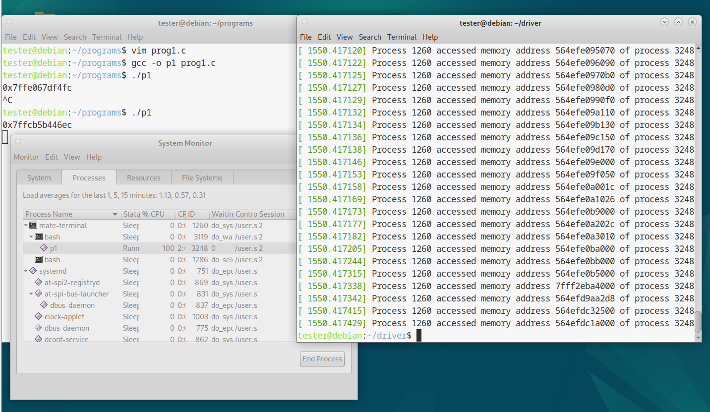

# Memory Watcher

## Description

Memory Watcher is a Linux kernel module designed for monitoring memory access of a specific process. It allows users to track and log memory access patterns of a process identified by its PID, providing insights into the process's behavior at the memory level.

## Table of Contents

- [Screenshots](#screenshots)
- [Installation](#installation)
- [Usage](#usage)
- [Contributing](#contributing)
- [License](#license)

## Screenshots



## Installation

To install Memory Watcher, follow these steps:

1. **Clone the Repository**: Clone this repository to your local machine using the following command:

```bash
git clone https://github.com/ashborn3/memory_watcher.git
cd memory_watcher
```

2. **Build the Module**: Use the provided Makefile to compile the module:

```bash
make all
```

3. **Load the Module**: Load the compiled module into the kernel:

```bash
sudo insmod memory_watcher.ko pid=YOUR_TARGET_PID\
```

Replace `YOUR_TARGET_PID` with the PID of the process you want to monitor.

## Usage

After loading the module with the desired PID, the module will start monitoring memory access by the specified process. Check the kernel log for output:

```bash
dmesg
```

To unload the module, use:

```bash
sudo rmmod memory_watcher
```

## Contributing

Contributions to Memory Watcher are welcome! Please refer to the contributing guidelines for more information on how to get involved.

## License

This project is licensed under the GPL License - see the LICENSE file for details.
